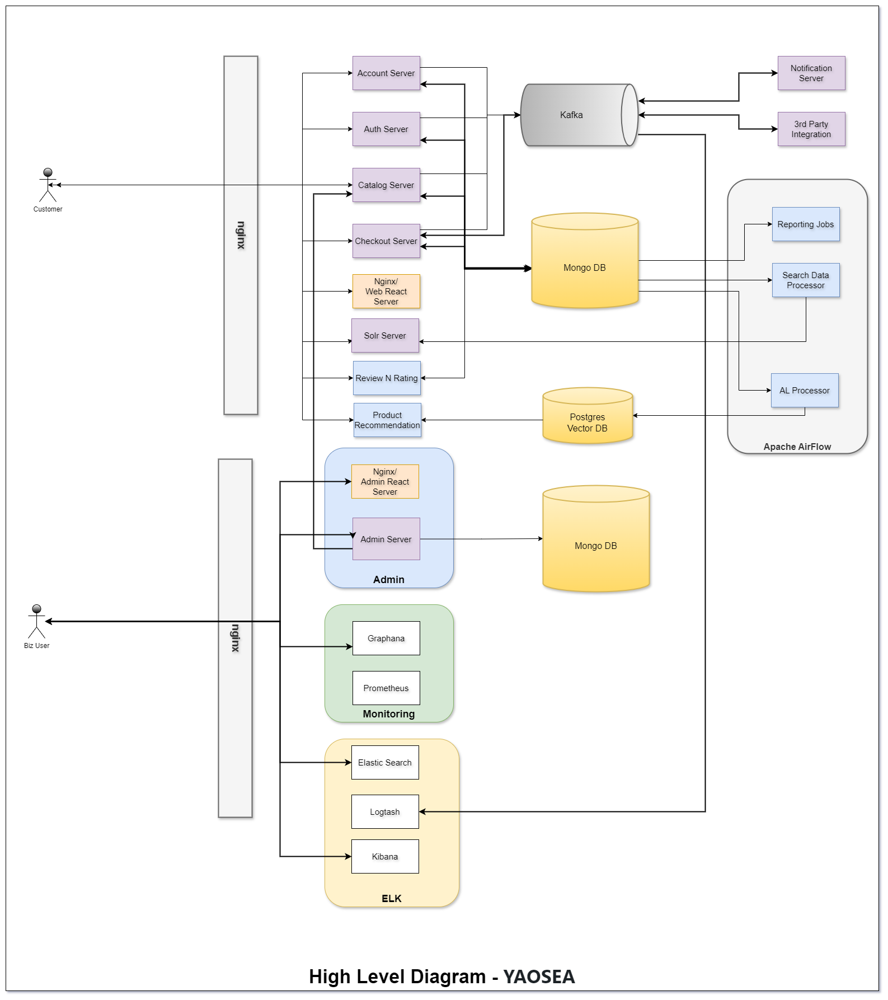

# E-Commerce Micro Service based application using Node Js, React, Solr and Mongo DB.   
This is ecommerece application for small scale ecommerece. It developed based on micro service arch using full stack technology. It use react code for front end and node as backend technology. It run on MongoDB (no-sql) databases. 

It has 4 different module 
1. Search engine, other backend server.
2. Admin server, which has product and order manager 
3. ELK 
4. Monitoring system with grapha based system.

This it is deployed using micro service architucture, which one of the altest development stack as it should be easy to upgrade and also integrate.

## High Level Arch

    
## Steps to setup and run   

## Still to develop 

#YAOSEA - Yet Another Open Source ECommerece Application
